# CPP-Talks
Repository to note important points on C++ talks
- [CPP-Talks](#cpp-talks)
- [2020](#2020)
  - [Algebraic Data Types](#algebraic-data-types)
    - [Types](#types)
  - [Effective replacement of dynamic polymorphism with std::variant](#effective-replacement-of-dynamic-polymorphism-with-stdvariant)
      - [Things to avoid on the fast path](#things-to-avoid-on-the-fast-path)
      - [Dynamic Polymorphism vs Variant](#dynamic-polymorphism-vs-variant)
  - [The Price of Dynamic Memory](#the-price-of-dynamic-memory)
      - [Memory Allocation and Allocators](#memory-allocation-and-allocators)
      - [Memory fragmentation](#memory-fragmentation)
    - [Memory Access Performance](#memory-access-performance)
      - [Memory Caches](#memory-caches)
  - [Design Patterns](#design-patterns)
  - [Exceptions](#exceptions)
      - [How they work](#how-they-work)
      - [When to use exceptions](#when-to-use-exceptions)
      - [When not to use them](#when-not-to-use-them)
      - [How to use exceptions properly](#how-to-use-exceptions-properly)
      - [Exception Safety Guarantees](#exception-safety-guarantees)
      - [Functions that should not fail](#functions-that-should-not-fail)
  - [Concurrency](#concurrency)
      - [Thread safe Static initialisation](#thread-safe-static-initialisation)
      - [Initialize a member with once_flag](#initialize-a-member-with-once_flag)
      - [Comparison of C++11’s primitives](#comparison-of-c11s-primitives)
      - [C++17 shared_mutex (R/W lock)](#c17-shared_mutex-rw-lock)
      - [Synchronization with std::latch C++ 20](#synchronization-with-stdlatch-c-20)
      - [Synchronization with std::barrier C++ 20](#synchronization-with-stdbarrier-c-20)
      - [Comparison of C++20’s primitives](#comparison-of-c20s-primitives)
  - [Breaking Dependencies: The SOLID Principles](#breaking-dependencies-the-solid-principles)
      - [Single Responsibility](#single-responsibility)
      - [Open Close Principle](#open-close-principle)
      - [Liscov's Substitution Principal](#liscovs-substitution-principal)
      - [Interface Segregation](#interface-segregation)
      - [Dependency Inversion Principal](#dependency-inversion-principal)
      - [Summary](#summary)
  - [Embrace No Paradigm Programming](#embrace-no-paradigm-programming)
- [2019](#2019)
  - [C++ Design Patterns: From C++03 to C++17 ](#c-design-patterns-from-c03-to-c17-)
    - [Builder Pattern](#builder-pattern)
    - [Visitor](#visitor)
  - [Destructor Case Studies: Best Practices for Safe and Efficient Teardown](#destructor-case-studies-best-practices-for-safe-and-efficient-teardown)
      - [Definition:](#definition)
    - [Virtual Destructors](#virtual-destructors)
      - [Order of Destruction](#order-of-destruction)
    - [Explicit Destructors](#explicit-destructors)
    - [Recommentdations](#recommentdations)
  - [Type Erasure](#type-erasure)
  - [RAII and Rule of Zero](#raii-and-rule-of-zero)
      - [The Rule of Three](#the-rule-of-three)
      - [The Rule of Zero](#the-rule-of-zero)
      - [Prefer Rule of Zero when possible](#prefer-rule-of-zero-when-possible)
      - [The Rule of Five](#the-rule-of-five)
      - [By-value assignment operator?](#by-value-assignment-operator)
      - [Examples of Resource Management](#examples-of-resource-management)
  - [Smart Pointers](#smart-pointers)
  - [Move Semantics](#move-semantics)
      - [Basics](#basics)
      - [Special member function generation rules](#special-member-function-generation-rules)
      - [Forwarding References](#forwarding-references)
      - [Perfect Forwarding](#perfect-forwarding)
      - [The Mechanics of std::forward](#the-mechanics-of-stdforward)
- [2018](#2018)
  - [CTAD in C++17](#ctad-in-c17)
  - [Design for Performance](#design-for-performance)
  - [50 shades of C++](#50-shades-of-c)
  - [C++ Function Templates: How do they work?](#c-function-templates-how-do-they-work)
- [2017](#2017)
  - [A Soupçon of SFINAE](#a-soupçon-of-sfinae)
  - [An inspiring introduction into Template Meta Programming](#an-inspiring-introduction-into-template-meta-programming)
- [2016](#2016)
  - [Want fast C++? Know your hardware!](#want-fast-c-know-your-hardware)
  - [Template Normal Programming](#template-normal-programming)
      - [Defining a template specialisation](#defining-a-template-specialisation)
      - [Partial Speciliasation](#partial-speciliasation)
      - [How to partially specialise a function right](#how-to-partially-specialise-a-function-right)
      - [Variadic Templates](#variadic-templates)
  - [Variadic Templates in C++11 / C++14 - An Introduction](#variadic-templates-in-c11--c14---an-introduction)
    - [Variadic function templates](#variadic-function-templates)
    - [Variadic class templates](#variadic-class-templates)

# 2020
## [Algebraic Data Types](https://www.youtube.com/watch?v=OJzmWqCCZaM)
[slides](https://github.com/CppCon/CppCon2020/blob/main/Presentations/back_to_basics_algebraic_data_types/back_to_basics_algebraic_data_types__arthur_odwyer__cppcon_2020.pdf)
### Types
* pair
* tuple
* optional
* variant
 
## [Effective replacement of dynamic polymorphism with std::variant](https://www.youtube.com/watch?v=gKbORJtnVu8)
[slides](https://github.com/CppCon/CppCon2018/blob/master/Presentations/effective_replacement_of_dynamic_polymorphism_with_stdvariant/effective_replacement_of_dynamic_polymorphism_with_stdvariant__mateusz_pusz__cppcon_2018.pdf)

#### Things to avoid on the fast path
* C++ tools that trade performance for usability (e.g. std::shared_ptr, std::function)
* Throwing exceptions on likely code path
* Dynamic polymorphism
* Multiple inheritance
* RTTI (Run Time Type Information): using dynamic_cast, typeid operators & typeinfo class
* Dynamic memory allocations
####  Dynamic Polymorphism vs Variant
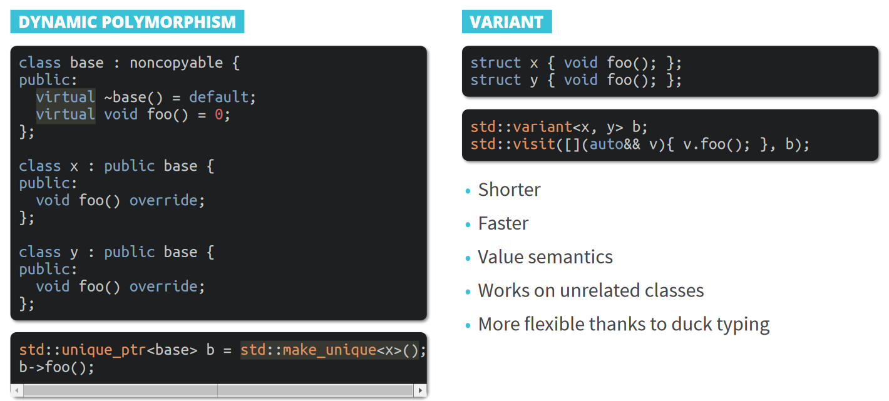
  
## [The Price of Dynamic Memory](https://www.youtube.com/watch?v=E01wFA1-0YM)
#### Memory Allocation and Allocators
* Dynamic memory is utilized using ```malloc``` & ```free``` in C , ```new``` & ```delete``` in C++.
  ```C++ 
  struct A {};

  A* ptr = (A*)malloc(sizeof(A));  // A pointer to a heap allocated A
  free(ptr); // deallocates memory

  ptr = (cast-type*) malloc(byte-size)
  ptr = (cast-type*)calloc(n, element-size);
  ptr = realloc(ptr, newSize);  // where ptr is reallocated with new size 'newSize'. Maintains already allocated values
  ```
  ```C++ 
  A* ptr = new A(); // calls malloc & constructor
  delete ptr; // calls destructor, and free

  A* ptrA = new A[10]; // Creates 10 As
  delete [] ptrA; // free them

  struct B {
    B(int i) {}
  };

  B* pt = new B(10);
  new (pt) B(100); // placement new. Use existing memory to create object
  B* ptr = new B[3]{1, 2, 3}; // constructs 3 Bs with different args
  ```
* Allocators & allocation process. Allocator is an implementation of malloc and free functions to allow the programme to allocate and deallocate memory.
* Allocator internally asks for large chunck of memory from OS and serves the program with smaller chunchks when malloc is called. 
#### Memory fragmentation
* In a long running programs continuous allocation and deallocation causes memory to be fragmented.
* Tackling memory fragmentation:
  * restart the program occatinally
  * preallocate all the needed  memory at the program beginnig. (Object pools)
  * cache memory chunks
  * use special memory allocators that promise low fragmentaion
### Memory Access Performance
* A program's performance will also depend on the way the memory is accessed. More specifically,
  * How the data is laid out in memory.
  * What is the access pattern of the data.
* Simple abstraction of malloc/free doesn't take the into account the underlying hardware. The highest performance can be gained by breaking the allocator abstraction. ie. if the algorithm knows how malloc/free works in order to allocate memory optimally.
####  Memory Caches  
* Memory speed is a bottle neck on mordern systems.  It can take around 300 CPU cycles to load data from main memory to CPU register. 
* On CPU memory called Cache memory is used to mitigate this.
  * In memory data access begin with loading data from main memory to the cache.
  * Eviction is the process of removing memory from cache wich is unused for some time.
  * CPU *data prefeter* can recognise memory access patterns for the program and pre load the data before it is required by the program.    
  
    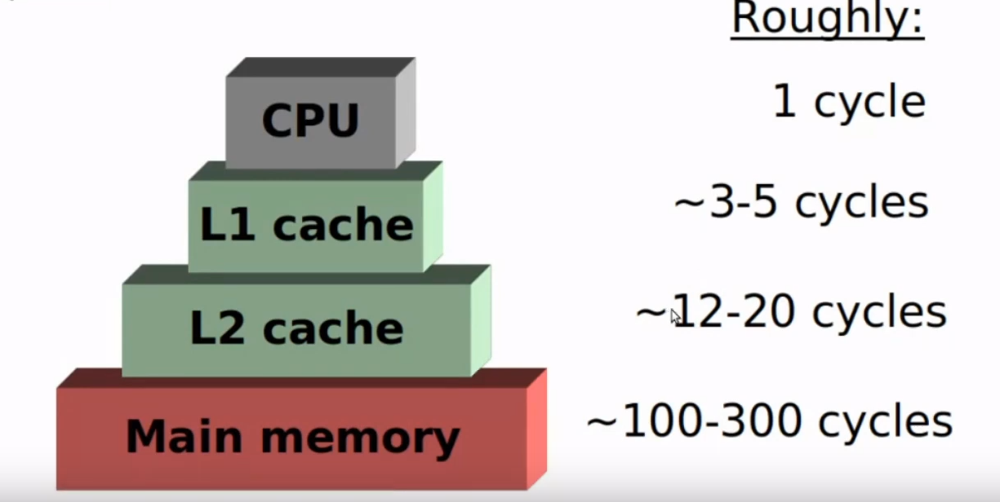
* Cache is divided in to cache lines. (typically 64bytes in modern systems)
* If data is oriented in a manner that they fit to the same cache line the access is optimised.
* Cache memory types:
  * Insturction cahce
  * Data cache
  * TLB cache - used to translate virtual memory to physical address

* Overhead of polymorpism
  * When it comes to polymorphism, the address of a non-virtual function is known at compile-time and the compiler can emit the call directly. The address of a virtual function is not known at compile-time and the compiler needs to figure it out during runtime. 
  *  For each class that has virtual functions, there is a virtual table (vtable) that contains the address of each of its virtual functions. Additionally, each instance of the type contains a pointer to this list (vtable*). This is a hidden instance member.    
    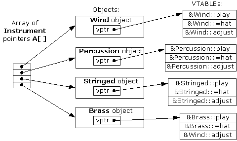
  * Array of pointers to objects  
  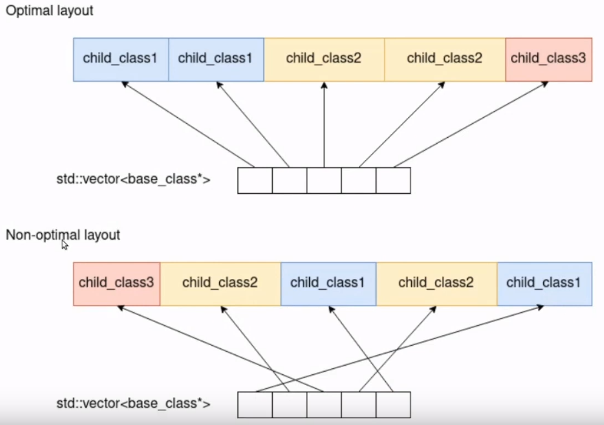
  * This can be prevented by using vector of objects instead of vector of object pointers. But it doesn't play nice with object oriented design. Specially polymorphism. 
  * std::variant is also a better apporach in this.
## [Design Patterns](https://www.youtube.com/watch?v=2UUqX2eIdSM&list=PLHTh1InhhwT5o3GwbFYy3sR7HDNRA353e&index=11)

## Exceptions
#### How they work
* Key words
  ```C++ 
  void f(){
      throw std::runtime_error();
  }

  try {
      f();
  } catch(std::exception const& ex)
  {

  }
  ```
*  Stack unwinding 
   *  Objects on the stack are destroyed in the reverse order they were created.
* Unhandle exceptions result in std::terminate getting called.

#### When to use exceptions
* For errors that are expected to happen rarely.
* For exceptional cases that cannot be handled locally. (I/O errors)
  *   File not found.
  *   Map key not found.
* For operators and constructors (i.e. When no other mechanism works)
#### When not to use them
* For errors that are expected to happen frequently.
* For functions that are excpeted to fail. (to_int(string))
* If you have to guarantee certain response times.
* For things that should never happen. (Assert)
  * Dereference nullptr
  * out of range access
  * Use after free
#### How to use exceptions properly
* Build on the std::exception Hierarchy
* Throw by Rvalue
    ```C++ 
    throw std::exception();
    ```
* Catch by reference
#### Exception Safety Guarantees
* Exception unsafe
  * No guarantees.
* Basic safety guarantee
  * Invariants are preserved.
  * Resources are not leaked.
  * Internal state might be changed.
* Strong Exception Safety Guarantee
  * Basic safety guarantees.
  * No state change. (commit or rollback)
  * Not always possible.
* No-Throw Guarantee
  * Operation cannot fail.
  * Expressed in the code with ```noexcept```
  
#### Functions that should not fail
* Destructors
* Move operations
* Swap Operations

## [Concurrency](https://www.youtube.com/watch?v=F6Ipn7gCOsY&list=PLHTh1InhhwT5o3GwbFYy3sR7HDNRA353e&index=14)
#### Thread safe Static initialisation
```C++ 
inline auto& SingletonFoo::getInstance() {
  static SingletonFoo instance;return instance;
  }
```
* The first thread to arrive will start initializing the static instance.Any more that arrive will block and wait until the first thread either succeeds (unblocking them all) or fails with an exception (unblocking one of them)
#### Initialize a member with once_flag
```C++ 
class Logger {    
  std::once_flag once_;
  std::optional<NetworkConnection> conn_; 
  
  NetworkConnection& getConn() {
    std::call_once(once_, []() {
      conn_ = NetworkConnection(defaultHost);
            });
    return *conn_;    }};
```
* Here, the first access to conn_ is protected by a once_flag.This mimics how C++ does static initialization, but for a non-static. Each Logger has its own conn_, protected by its own once_.

#### Comparison of C++11’s primitives

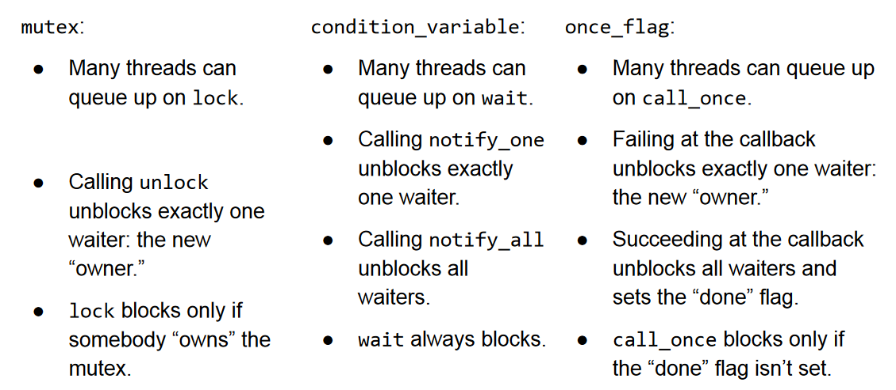

#### C++17 shared_mutex (R/W lock)
```C++ 
class ThreadSafeConfig
{
    std::map<std::string, int> settings_;
    mutable std::shared_mutex rw_;
    void set(const std::string &name, int value)
    {
        std::unique_lock<std::shared_mutex> lk(rw_);
        settings_.insert_or_assign(name, value);
    }
    int get(const std::string &name) const
    {
        std::shared_lock<std::shared_mutex> lk(rw_);
        return settings_.at(name);
    }
};
```
* unique_lock calls rw_.lock() in its constructor and rw_.unlock() in its destructor.shared_lock calls rw_.lock_shared()in its constructor and rw_.unlock_shared()in its destructor.

#### Synchronization with std::latch C++ 20
  ```C++ 
  std::latch myLatch(2);
  std::thread threadB = std::thread([&]() {
    myLatch.arrive_and_wait();  
    printf("Hello from B\n");
  });
  printf("Hello from A\n");
  myLatch.arrive_and_wait();
  threadB.join();
  printf("Hello again from A\n");
  ```
#### Synchronization with std::barrier C++ 20
  ```C++ 
  std::barrier b(2, [] { puts("Green flag, go!"); });
  std::thread threadB = std::thread([&]() {        
    printf("B is setting up\n");        
    b.arrive_and_wait();
    printf("B is running\n");
  });
  printf("A is setting up\n");
  b.arrive_and_wait();
  printf("A is running\n");
  threadB.join();
  ```
  #### Comparison of C++20’s primitives
  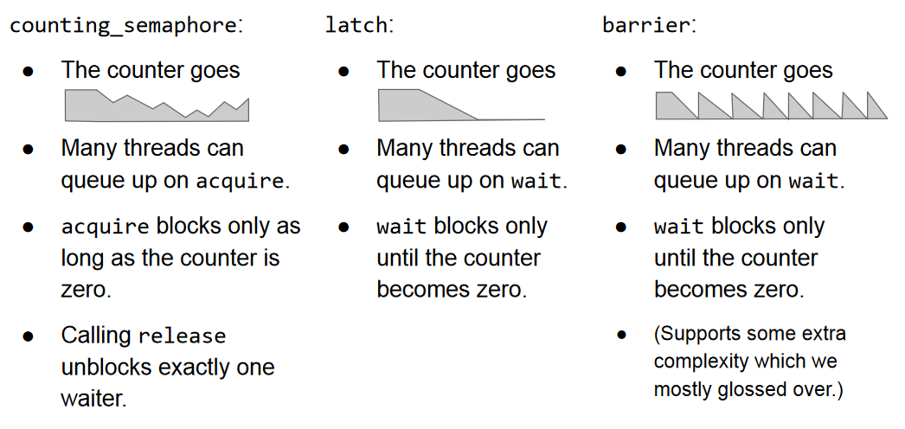
<br></br>
<br></br>

## [Breaking Dependencies: The SOLID Principles](https://www.youtube.com/watch?v=Ntraj80qN2k)
* **S**ingle Responsibility
* **O**pen Close 
* **L**iscove's Substitution
* **I**nterface Segregation
* **D**ependency Inversion

#### Single Responsibility
* Orthogonality: Software Components (functions, classes, modules) should be self contained, with a single, well defined purpose. One should be able to change without worrying about the others.
* Cohesion measures the strength of association inside a module. A highly cohesive module is a collection of statements and data that should be treated as a whole.

| BAD | Good|
|-----|-----|
| 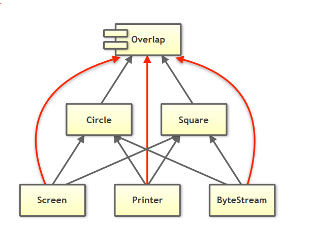 |  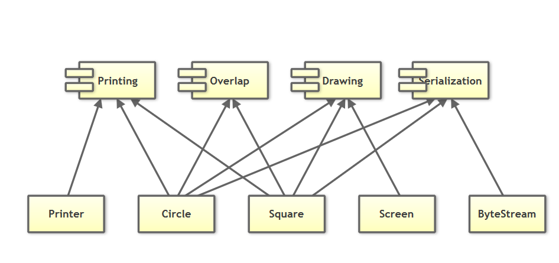 |
* Guideline:  Prefer  cohesive  software  entities.  Everything  that  does  not strictly belong together, should be separated

#### Open Close Principle
* Software should be open for extension but closed for modification.
* Creating an object hierarchy based on types and switching between them violates open close principle. Creating an object heirarchy based on operations (virtual functions) can get rid of this but violates SRP.
* Guideline:  Prefer  software  design  that  allows  the  addition  of  types  or operations without the need to modify existing code
#### Liscov's Substitution Principal
* Subtypes must be substitutable for thier base type. 
* If you inherit from a base class make sure you keep the contracts of the base types. You guarantee that the behavior of base type is not broken.
  
Behavioral subtyping (aka “IS-A” relationship)
 * Contravariance of method arguments in a subtype 
 * Covariance of return types in a subtype 
 * Preconditions cannot be strengthened in a subtype 
 * Postconditions cannot be weakened in a subtype 
 * Invariants of the super type must be preserved in a subtype
#### Interface Segregation 
* Many client specific interfaces are better than one general-purpose interface
* Stratergy Pattern
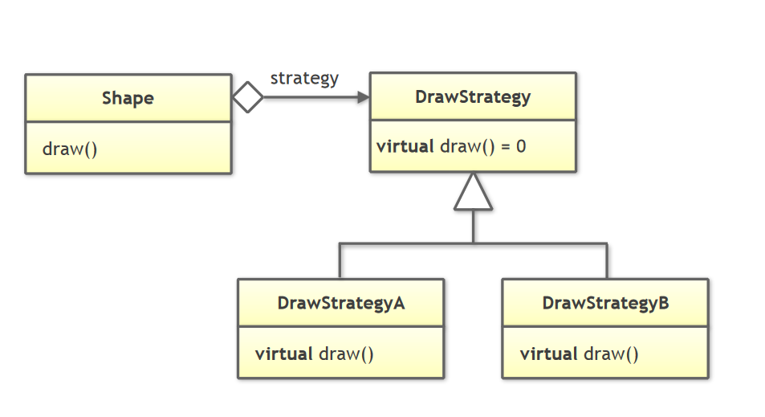

```C++
class Circle;
class Square;
class DrawCircleStrategy
{
public:
    virtual ~DrawCircleStrategy() {}
    virtual void draw(const Circle &circle) const = 0;
};
class DrawSquareStrategy
{
public:
    virtual ~DrawSquareStrategy() {}
    virtual void draw(const Square &square) const = 0;
};

```

#### Dependency Inversion Principal
* The Dependency Inversion Principle (DIP) tells us that the most flexible systems are those in which source code dependencies refer only to abstractions, not to concretions.
  * High-level modules should not depend on low-level modules. Both should depend on abstractions.
  * Abstractions should not depend on details. Details should depend on abstractions.

  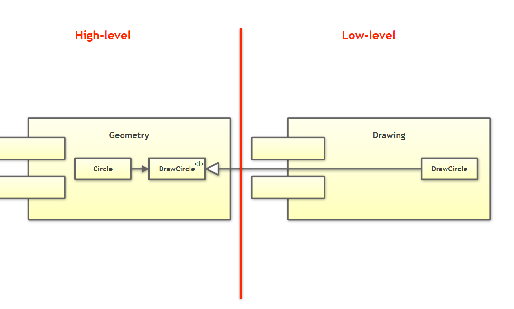

* Model Veiw controller
  

* Prefer  to  depend  on  abstractions  (i.e.  abstract  classes  or concepts) instead of concrete types

#### Summary
* The SOLID principles are more than just a set of OO guidelines
*  Use the SOLID principles to reduce coupling and facilitate change
   *  Separate concerns via the SRP to isolate changes
   *   Design by OCP to simplify additions/extensions
   *   Adhere to the LSP when using abstractions 
   *   Minimize the dependencies of interfaces via the ISP
   *    Introduce abstractions to steer dependencies (DIP)

## [Embrace No Paradigm Programming](https://www.youtube.com/watch?v=fwXaRH5ffJM)

# 2019
## [C++ Design Patterns: From C++03 to C++17 ](https://www.youtube.com/watch?v=MdtYi0vvct0)
[slides](https://github.com/CppCon/CppCon2019/blob/master/Presentations/design_patterns/design_patterns__fedor_pikus__cppcon_2019.pdf)
### Builder Pattern
* Used to construct complex objects that are initialized in multiple stages
### Visitor
* Seperates the algorithm from the object structure which is the data of the algorithm.
* Adds new operations to the classs hierarchy without modifying the classes themselves.
* Uses double dispatching.
*  
## [Destructor Case Studies: Best Practices for Safe and Efficient Teardown](https://www.youtube.com/watch?v=XvWyLAW_U0Q)
#### Definition: 
One, deterministic, automatic, symmetric, special member function with 
  * No name
  * No parameters
  * No return type    
Designed to give last rites before object death.

### Virtual Destructors
Guarantee that derived classes get cleaned up if ```delete``` on a ```Base*``` could ever point to ```Derived*```.
#### Order of Destruction
Rule of thumb: Reverse order of constructoin.
Specifically: 
  1. Destructor body
  2. Data members in the reverse order of declaration.
  3. Direct non-virtual base classes in reverse order.
  4. Virtual base classes in reverse order.

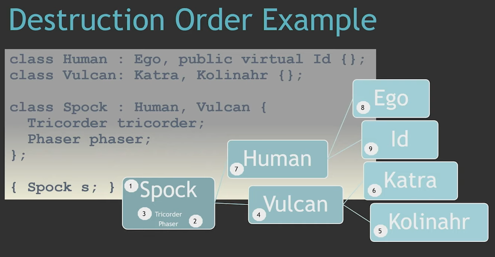

### Explicit Destructors
* Destructors can be called directly
* Very powerfull for custom memroy scenarios
* Use-cases
  * Paired with placement new
  * std::vector
  * Custom allocators
### Recommentdations
* Best destructor is no defined destructor. Even the default. Only defulting the destructor will not generate implicit copy and move constructors.
* Avoid calling public functions in destructors. 
* Put any resource that needs to be released in its own object(RAII)
* Dtors are called only for fully constructed objs. If ctor throws, object is not fully contructed. 
* If there are virutal functions in a class it also should have a **virtual public destructor**.
* Virtual fucntions are not virtual inside constructors or destructors. Don't call virtual functoins in ctors or dtors.
* Destructors should never throw.


## [Type Erasure](https://www.youtube.com/watch?v=tbUCHifyT24&list=PLXTVlgmc2KcD3mgkZfrq3jJl8RNaAz-lp&index=27)
[Slide](https://github.com/CppCon/CppCon2019/blob/master/Presentations/back_to_basics_type_erasure/back_to_basics_type_erasure__arthur_odwyer__cppcon_2019.pdf)   


## [RAII and Rule of Zero](https://www.youtube.com/watch?v=7Qgd9B1KuMQ&t=215s)
* [Slides](https://github.com/CppCon/CppCon2019/blob/master/Presentations/back_to_basics_raii_and_the_rule_of_zero/back_to_basics_raii_and_the_rule_of_zero__arthur_odwyer__cppcon_2019.pdf)
* A destructor is used in a class to clean up all the resources that it created and used during its life time.
* If a resource managing class has a destructor and is also copyable, it should have copy constructor and copy assignment in order to get rid of double deletion issues.
#### The Rule of Three
* If your class directly manages some kind of resource (such as a new’ed pointer), then you almost certainly need to hand-write three special member functions:
  * A Destructor to free the resource
  * A Copy Constructor to Copy the resource
  * A Copy Assignment Operator to free the left-hand resource and copy the right-hand one
* Use the copy-and-swap idiom to implement the assignment.
  ```C++ 
  NaiveVector &NaiveVector::operator=(const NaiveVector &rhs)
  {
      NaiveVector copy(rhs);
      copy.swap(*this);
      return *this;
  }
  ```
#### The Rule of Zero
* If your class does not directly manage any resource, but merely uses library components such as vector and string, then you should strive to write no special member functions.Default them all!
* Let the compiler **implicitly** generate all rule of 3 special funcitons.
#### Prefer Rule of Zero when possible
There are two kinds of well-designed value-semantic C++ classes:
* Business-logic classes that do not manually manage any resources, and follow the Rule of Zero 
  * They delegate the job of resource management to data members of types such as std::string
* Resource-management classes (small, single-purpose) that follow the Rule of Three
  * Acquire the resource in each constructor; free the resource in your destructor; copy-and-swap in your assignment operator
#### The Rule of Five
* If your class directly manages some kind of resource (such as a new’ed pointer), then you may need to hand-write five special member functions for correctness and performance:
  * A Destructor to free the resource
  * A Copy Constructor to Copy the resource
  * A move constructor to transfer ownership of the resource
  * A Copy Assignment Operator to free the left-hand resource and copy the right-hand one
  * A move assignment operator to free the left-hand resource and transfer ownership of the right-hand one
```C++ 
NaiveVector &NaiveVector::operator=(const NaiveVector &rhs)
{
    NaiveVector copy(rhs);
    copy.swap(*this);
    return *this;
}
NaiveVector &NaiveVector::operator=(NaiveVector &&rhs)
{
    NaiveVector copy(std::move(rhs));
    copy.swap(*this);
    return *this;
```
#### By-value assignment operator?
* Write just one assignment operator and leave the copy up to the caller.
  ```C++ 
    NaiveVector &NaiveVector::operator=(NaiveVector copy)
  {
      copy.swap(*this);
      return *this;
  }
  ```
#### Examples of Resource Management
```C++ 
  class A {
    ~A(); // Destrutor
    A(A const& rhs);
    A(A && rhs);
    A& operator=(A const& rhs);
    A& operator=(A && rhs);
  }
```
| Class | ~A() | A(A const& rhs) | A(A && rhs) | A& operator=(A const& rhs) | A& operator=(A && rhs) |
|------|-------|-----------------|--------|----------|--------|
|unique_ptr | Calls delete on raw ptr| DMS. deleted| Transfers the ptr. Null the rhs| DMS. deleted| Calls delete on lhs ptr. Transfers the rhs ptr to lhs. Nulls rhs. |
|shared_ptr|   decrement refcount. Clean if zero.|  increment refcount | Transfer ownership. No change to refcount.| decrement old refcount. Increment the new refcount. | decrement old refcount. Transer the ownership | 
|unique_lock| unlock mutex| DMS. deleted. | Transfer ownership. No change to mutex| DMS. deleted.| unlock old mutex. Transfer ownership.|
|ifstream| Calls close on the handle. | deleted. | Transfer handle and buffrer content. | deleted. | Closes old. Transfers handle and buffer| 
## [Smart Pointers](https://www.youtube.com/watch?v=xGDLkt-jBJ4)

## [Move Semantics](https://www.youtube.com/watch?v=St0MNEU5b0o)
* Slieds: [Part 1](https://github.com/CppCon/CppCon2019/blob/master/Presentations/back_to_basics_move_semantics_part_1/back_to_basics_move_semantics_part_1__klaus_iglberger__cppcon_2019.pdf) [Part 2](https://github.com/CppCon/CppCon2019/blob/master/Presentations/back_to_basics_move_semantics_part_2/back_to_basics_move_semantics_part_2__klaus_iglberger__cppcon_2019.pdf)
#### Basics
* Lvalues are any memory address with a name.
* Rvalues doesnt have a name. They represent objects that are no longer needed at caller side.
* ```std::move()``` **unconditionally** casts it input to **Rvalue reference**. 
    * It doesn't move anything.
    ```C++ 
    template <typename T>
    std::remove_reference_t<T> &&
    move(T &&t) noexcept { 
        return static_cast<std::remove_reference_t<T> &&>(t);
     }
    ```
#### Special member function generation rules
* Default move operations are generated if no destructor or copy operations is **user defined**.
* Default copy operations are generated if no move operations is user defined.
* Note: =default and =delete count as user-defined

#### Forwarding References
```C++ 
template< typename T > 
void f( T&& x );       // Forwarding reference 
auto&& var2 = var1;    // Forwarding reference
```
* Forwarding references represent 
  *  ... an lvalue reference if they are initialized by an lvalue; 
  *  ... an rvalue reference if they are initialized by an rvalue
*  Rvalue references are forwarding references if they 
   *  ... involve type deduction; 
   *  ... appear in exactly the form T&& or auto&&.
* Forwarding references use reference collapsing to do its magic.
  * The rule is very simple. & always wins. So & & is &, and so are && & and & &&. The only case where && emerges from collapsing is && &&.
  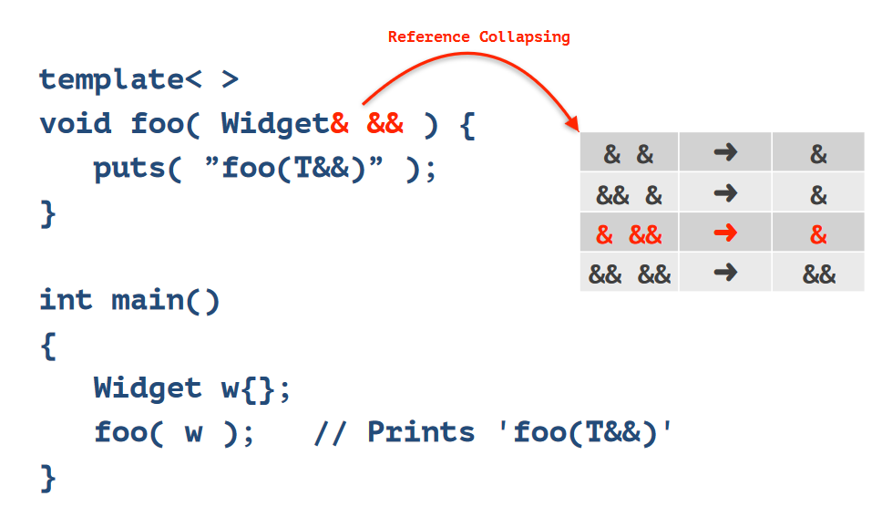
 #### [Perfect Forwarding](https://youtu.be/pIzaZbKUw2s?t=458)
 * Solves the problem of writing a function which merely forwarding its arguments to another function.
  ```C++ 
  namespace std
  {
      template <typename T, typename... Args>
      unique_ptr<T> make_unique(Args && ... args) 
      { 
          return unique_ptr<T>(new T(std::forward<Args>(args)...)); 
          }
  } // namespace std
  ```
#### The Mechanics of std::forward
* std::forward conditionally casts its input into an rvalue reference   
  *  If the given value is an lvalue, cast to an lvalue reference 
  *  If the given value is an rvalue, cast to an rvalue reference
* std::forward does not forward anything
```C++ 
template <typename T>
T &&forward(std::remove_reference_t<T> &t) noexcept 
{ 
    return static_cast<T &&>(t);
}
```
# 2018
## [CTAD in C++17](https://www.youtube.com/watch?v=UDs90b0yjjQ)

## [Design for Performance](https://www.youtube.com/watch?v=m25p3EtBua4)
[slides](https://github.com/CppCon/CppCon2018/blob/master/Presentations/design_for_performance/design_for_performance__fedor_pikus__cppcon_2018.pdf)

## [50 shades of C++](https://www.youtube.com/watch?v=9-_TLTdLGtc)
## [C++ Function Templates: How do they work?](https://www.youtube.com/watch?v=NIDEjY5ywqU)

* Template specialisations doesn't contribute to overload resolution.
  
# 2017
## [A Soupçon of SFINAE](https://www.youtube.com/watch?v=ybaE9qlhHvw&list=PLXTVlgmc2KcD3mgkZfrq3jJl8RNaAz-lp&index=12)
[Slides](https://github.com/CppCon/CppCon2017/blob/master/Presentations/A%20Soupcon%20of%20SFINAE/A%20Soupcon%20of%20SFINAE%20-%20Arthur%20O%27Dwyer%20-%20CppCon%202017.pdf)

 
## [An inspiring introduction into Template Meta Programming](https://www.youtube.com/watch?v=UnIc_qJ0DRc)

# 2016
## [Want fast C++? Know your hardware!](https://www.youtube.com/watch?v=BP6NxVxDQIs)
* Know if you are bound by computation or bound by data access.
* Prefer contiguous data in memory.
* Prefer constant strides to randomness.
* Keep data close together in space. 
* Avoid dependencies between successive computations.
* Avoid hard to predict branches
* Be aware of cache lines & alignment.
* Minimise number of  cache lines accessed by multiple threads.
* Don't be suprised by hardware weirdness. (Cache associativity, denormals)

## [Template Normal Programming](https://www.youtube.com/watch?v=vwrXHznaYLA)
Slides [P1](https://github.com/CppCon/CppCon2016/blob/master/Tutorials/Template%20Normal%20Programming%2C%20Part%201/Template%20Normal%20Programming%2C%20Part%201%20-%20Arthur%20O'Dwyer%20-%20CppCon%202016.pdf) [P2](https://github.com/CppCon/CppCon2016/blob/master/Tutorials/Template%20Normal%20Programming%2C%20Part%202/Template%20Normal%20Programming%2C%20Part%202%20-%20Arthur%20O'Dwyer%20-%20CppCon%202016.pdf)

* function templates and class templates existed in C++ prior C++11.
  ```C++ 
  // Function template example
  template<typename T>
  T swap(T& a, T& b)
  {
    T temp = a;
    a = b;
    b = temp;
  }
  // class template example
  template<class T>
  struct User {
    T networth;
    static int id;
  }

  template<class T>
  int User<T>::id = 0;
  ```
* Two new kinds of templates.  
    * *alias templates* in C++11.  
    * *variable templates* in C++14.
* variable templates - exactly 100% same to a static data member of a class template.
  ```C++ 
  template<typename T>
  struct is_void{  // template with a static data member
    static const bool value = (some exrpession)
  }

  template<typename T> // equivalent variable template
  const bool is_void_v = (some expresssion)
  ```
* Aliasing is same as typedef with different syntax.
  ```C++ 
  typedef std::vector<int> myvec_int; // C++03 alias syntax
  using myvec_double = std::vector<double>; // C++11 syntax

  template<typename T>
  using myvec = std::vector<T>; // C++11 syntax

  int main(){    
    static_assert(is_same_v<myvec_int, std::vector<int>>);   
    static_assert(is_same_v<myvec_double, std::vector<double>>);   
    static_assert(is_same_v<myvec<float>, std::vector<float>>);
  }
  ```
* Calling specialisations explicitly.
  ```C++ 
  template<typename T>
  T abs(T x) 
  {
    return (x >=0) ? x : -x;
  }

  main ()
  {
    abs<int>('x'); // [T = int]
    abs<double>(3); // [T = double]
  }
  ```
* Default template parameters. 
  ```C++ 
  template<typename T = char *>
  void add() {}

  main()
  {
    add<int>(); // [T = int]
    add<>(); // [T = char *]
    add(); // [T = char* ]
  }
  ```
* Template type deduction for references.
  ```C++ 
  template<typename T>
  void f(T t) {}

  template<typename T>
  void g(T* t){}

  template<typename T>
  void h(T& t){}

  template<typename T>
  void k(T&& t){}

  main()
  {
    int i = 5;
    f(i);             // --> 1
    g(&i);            // --> 2
    h(i);             // --> 3
    k(std::move(i));  // --> 4
    k(i);             // --> 5

    const int p = 0;
    k(p);             // --> 6
    k(std::move(p));  // --> 7
  }
  ``` 
  | scenario | Template deduciton |
  |----------| -------------------|
  | 1        |  T = int |
  | 2        |  T = int |
  | 3        |  T = int |
  | 4        |  T = int |
  | 5        |  T = int& |
  | 6        |  T = const int&|
  | 7        |  T = const int|

 Here for 5th scenario reference collapsing happens. We need to have a lvalue reference inside the function parameter after T's type is deducted. This is because the input parameter is ```i``` and it acts as ```int&```. In order to have a lvalue reference as a result when the function parameter already has && in it T should be int&.

```C++ 
template<typename T>
void f(T& t){}

int main()
{
  int i = 42;
  f(static_cast<int&>(i)); // --> 1
  f(static_cast<int&&>(i)); // --> 2
  f(static_cast<volatile int&>(i)); // --> 3
  f(static_cast<volatile int&&>(i)); // --> 4
  f(static_cast<const int&>(i));      // --> 5
  f(static_cast<const int&&>(i));     // --> 6
}
```

  | scenario | Template deduciton |
  |----------| -------------------|
  | 1        |  T = int |
  | 2        |  Compile time error. Cannot deduce T to become ```int&&``` |
  | 3        |  T = volatile int |
  | 4        |  Compile time error. Cannot deduce T to become ```volatile int&&``` |
  | 5        |  T = const int |
  | 6        |  T = const int **special case to support backward compatibility**|

  #### Defining a template specialisation
  * Prefix the definition with ```template<>```, and then write the function definition as if you were using the specialisation you want to write.
  ```C++ 
  template<typename T>
  struct is_void {
    static constexpr bool value = false;
  }

  template<> // Specialisation 
  struct is_void<void> {
    static constexpr bool value = true;

  template<typename T>
  T abs(T x) {}

  template<> // Specialisation 1
  int abs<int>(int x){}  

  template<> // Specialisation 2
  int abs<>(int x){}

  template<> // Specialisation 3, often used
  int abs(int x){}    
  ```
  #### Partial Speciliasation
  ```C++ 
  // primary template
  template<typename T>
  constexpr bool is_array = false;
 
  // These are partial specialisations
  template<typename Tp>
  constexpr bool is_array<Tp[]> = true;

  template<typename Tp, int N>
  constexpr bool is_array<Tp[N]> = true;

  // this is a full specialisation
  template<>
  constexpr bool is_array<void> = true;
  ```
####  How to partially specialise a function right
* If you want a partial specialisation then delegate all the work to a class template and partially specialise it.
```C++ 
template<typename T> // Primary class template
class is_pointer_impl{
  static bool _(){return false;}
};

template<typename Tp>
class is_pointer_impl<Tp*> {
  static bool _(){return true;}
};

template<typename T>
bool is_pointer(T x){
  return is_pointer_impl<T>::_();
}
```
#### Variadic Templates


## [Variadic Templates in C++11 / C++14 - An Introduction](https://www.youtube.com/watch?v=R1G3P5SRXCw)
[Slides](https://github.com/CppCon/CppCon2015/blob/master/Presentations/Variadic%20Templates%20-%20Guidelines,%20Examples%20and%20Compile-time%20computation/Variadic%20Templates%20-%20Guidelines,%20Examples%20and%20Compile-time%20computation%20-%20Peter%20Sommerlad%20-%20CppCon%202015.pdf)
### Variadic function templates
* Defining a variadic template function
  
  ```C++ 
  template<typename... ARGS> // --> any number of types
  void fun(ARGS... args) // --> any number of arguments
  {
    println(args...); // -> expand parameters as arguments
  }
  ```
* Syntax uses **...** (ellipsis) symbol in serveral places.
  | place | meaining | example|
  |-------|----------|--------|
  | In front of a name | **define** name as a place holder for a variable number of elements. | ```typename... ARGS``` | 
  | After a name | **expand** the name to a list of all elements it represents.| ```args...```|
  | between two names | define the second name as a list of parameters given by the first.  | ```ARGS... args```  |

* Variadic terminology
  ```C++ 
  template<typename... T> // --> template type parameter pack
  void funct(T... args) // --> function parameter pack
  {
    x(args...); // --> pack expansion
  }
  ```
  * Pack expansion can be done after an expression using the parameter pack
  * special version of sizeof...(pack) yields n-of-args
* Implementing a variadic template function
  * Key is recursion in the definitions
    * base case with zero arguments
    * recursive case with 1 explicit argument and a tail consisting of a variadic list of arguments
  ```C++ 

  void print(){}  // base case

  template<typename T1, typename... T>
  void print(T1 t1, T... args)
  {

    cout << t1;
    if(sizeof ...(args))
      cout << ", ";

    print(args...); //recurse on tail 
  }
  ```
### Variadic class templates
 * Used in ```std::tuple``` which is a means to pass parameter packs around as a single element.
    ```C++ 
    auto tup = std::make_tuple(1, 2, "three");
    int a; double b; string s;
    std::tie(a, b, s) = tup;
    ```
* use ... in **template template parameters.**
  * template with std::vector as return container
    ```C++ 
    template<typename T1, typename... T>
    auto getContianer(T1 t, T... args)
    {
        std::vector<T1> vect {t, args...};
        return vect;
    }

    int main()
    {
        // Create a container from any number of given of elements. Elements can be of any type and container is defaulted to vector but can  be changed.
        auto intCont = getContianer(1, 2, 3, 4);
        auto charCont = getContianer('1', '1', '1');
        
        return 0;
    }
    ```
  * template return container for any container type
    ```C++ 
    template<template<typename, typename...> class ContainerType = std::vector, // template template paramerter defaulted to std::vector
     typename T1, typename... T>
    auto getContainer(T1 t, T... args)
    {
      ContainerType<T1> cont = {t, args...};
      return cont;
    }

    int main()
    {
        // Create a container from any number of given of elements. Elements can be of any type and container is defaulted to vector but can  be changed.
        auto intCont = getContianer(1, 2, 3, 4);
        auto charCont = getContianer<std::list>(1, 2, 3, 4);
        
        cout << typeid(intCont).name() << endl;  // prints St6vectorIiSaIiEE
        cout << typeid(charCont).name() << endl; // prints  St4listIiSaIiEE
        return 0;
    }
    ```


